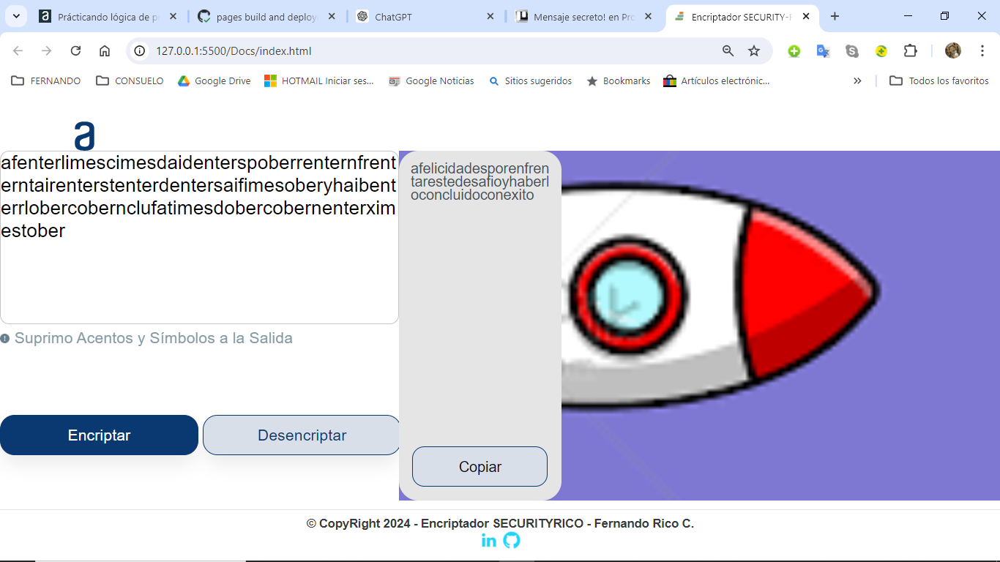

Archivo Readme SECURITYRICO

Desarrolador: Fernando Rico Contreras Bogotá-Colombia.

url: https://www.linkedin.com/in/fernando-rico-contreras-42911230/

# Encriptador SECURITYRICO
## Descripción
Este proyecto es el resultado del curso Practicando Lógica de Programación: Challenger Encriptador de la Formación en Programación de la Alianza entre las empresas Alura Latam y Oracle Alura Latam ONE - Oracle Next Education Grupo 7.

Encriptador-SECURITYRICO es una herramienta de encriptación de datos que proporciona una capa adicional de seguridad para tus archivos sensibles. Utiliza algoritmos avanzados para asegurar la integridad y privacidad de la información.

## Capturas de Pantalla

.png)
.png)
.png)
.png)
.png)
.png)
.png)


## Instalación

Para instalar Encriptador-SECURITYRICO, sigue estos pasos:

Clona el repositorio:
   ```bash
   git clone https://github.com/AmigoColombiano/Encriptador-SECURITYRICO.git


## Uso GENERAL

### Encriptar

Tienes que dar clic sobre el aviso: "Ingrese El Texto Aquí" y luego ingresar tu mensaje sin letras mayúsculas ni acentos ni espacios ni simbolos o caracteres especiales. 

Para encriptar un mensaje, utiliza el botón encriptar.

Si deseas iniciar de nuevo el programa, debes dar clic en el ícono actualizar del navegador

### Desencriptar

Para dencriptar un mensaje, utiliza el botón Desencriptar, primero dando clic sobre el botón copiar y luego pegando sobre el area de ingreso del mensaje. También puedes copiar un mensaje encriptado que lo debes copiar al portapapeles después de dar clic al botón copiar y luego haciendo paste sobre el area de ingreso del mensaje.

Si deseas iniciar de nuevo el programa, debes dar clic en el ícono actualizar del navegador

## Créditos

Gracias a [Alura Latam](https://app.aluracursos.com/) por su asistencia y [Oracle](https://www.oracle.com/co/) por proporcionar una plataforma excelente para estudiar virtualmente y actualizarse en las TIC´s.

Gracias a [OpenAI](https://openai.com) por su asistencia y [GitHub](https://github.com) por proporcionar una plataforma excelente para alojar el proyecto.

